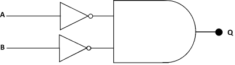
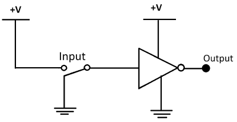
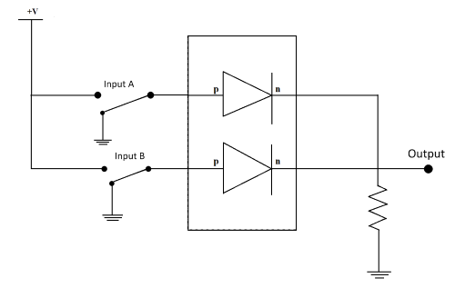

##  Pre Test 
#### Please attempt the following questions

Q1. One of the statements of De-Morgan’s theorem states that
  
<b>A     (AB)' = A' + B'</b>  
B     (A + B) = A'.B'  
C     (A' + B') = A'B'  
D     (AB)' = A' + B  
 
  

Q2. 'AND' and 'OR' operations are interchangeable through negations

A     Sometimes  
<b>B     Always</b>  
C     Never  
D     Not Sure  
 
  

Q3. The circuit diagram shown below represents

<b>A     Negative AND logic</b>  
B     Positive AND logic  
C     Negative NAND logic  
D     Positive NAND logic  
 
  

Q4. If individual negations are applied on two AND statements then its same statement is

A     NOR-OR statement  
<b>B     NOT-OR statement</b>  
C     NAND-AND statement  
D     NOT-AND statement  
 
  

Q5. Identify the logic gate that can be drawn from below diagram

A     AND gate  
B     NAND gate  
<b>C     NOT gate</b>  
D     NOR gate  
 
  

Q6. If individual negations are applied on two OR statements then its same statement is

A     NOR-OR statement  
B     NOT-OR statement  
C     NAND-AND statement  
<b>D     NOT-AND statement</b>  
 
  

Q7. Identify the logic function described by given diagram

<b>A     OR gate</b>  
B     AND gate  
C     XOR gate  
D     NAND gate  
 
  

Q8. As per De-Morgan’s Law, (A U B)' is equal to

<b>A     (A' ∩ B')</b>  
B     (A' U B')  
C     (A ∩ B)'  
D     (A' + B')  
 
  

Q9. Identify the type of gate represented by phrase 'Any low input guarantees high output'.

A     OR gate  
B     AND gate  
C     NOR gate  
<b>D     NAND gate</b>  
 
  

Q10. As per De-Morgan’s Law, (A ∩ B)' is equal to

A     (A' ∩ B')  
<b>B     (A' U B')</b>  
C     (A ∩ B)'  
D     (A' + B')  
  

