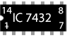

## Procedure 

1.  Under Simulation, click **Theorem 1** or **Theorem 2**.

#### **Familiarise with components**

  
&emsp; &emsp; &emsp; &emsp; &emsp; &emsp; ")&emsp; ")  

**Fig. 1 Components** 

#### 1st Theorem :-
  

**L.H.S. term for De-Morgan’s 1st theorem, i.e (A + B)' :–**  

1.  Click on the **Component** button to place components on the table.
2.  Make connections as per the circuit diagram and pin diagrams of ICs or according to connection table.

  

  

**Fig. 2 Circuit diagram of (A + B)'**

  

**Fig. 3 Pin diagram of IC 7432**  **Fig. 4 Pin diagram of IC 7404**

**Table 1: Connection table for (A + B)'**

  
3.  Click on **Check Connections** button. If connections are right, click on **‘OK’**, then **Simulation** will become active.
4.  Provide the input by clicking toggle switches **A** and **B**.
5.  Fill the observed values in the **Truth Table**.
6.  Verify **Truth Table** by clicking on **Check** button, if outputs are correct then click on **OK**.
7.  Click on the **Result** button provided below the table.
  

**R.H.S. term for De-Morgan’s 1st theorem, i.e A'B' :–**  

1.  Click on the **Component** button to place components on the table.
2.  Make connections as per the circuit diagram and pin diagrams of ICs or according to connection table.

  

**Fig. 5 Circuit diagram of A'.B'**

**Fig. 6 Pin diagram of IC 7408**

**Fig. 7 Pin diagram of IC 7404** 

**Table 2: Connection table for A'.B'**

  
3.  Click on **Check Connections** button. If connections are right, click on **‘OK’**, then **Simulation** will become active.
4.  Provide the input by clicking toggle switches **A** and **B**.
5.  Fill the observed values in the **Truth Table**.
6.  Verify **Truth Table** by clicking on **Check** button, if outputs are correct then click on **OK**.
7.  Click on the **Result** button provided below the table.

#### 2nd Theorem :-  

**L.H.S. term for De-Morgan’s 2nd theorem, i.e (A.B)' :–**  

1.  Click on the **Component** button to place components on the table.
2.  Make connections as per the circuit diagram and pin diagrams of ICs or according to connection table.

  

**Fig. 8 Circuit diagram of (A.B)'**

**Fig. 9 Pin diagram of IC 7408**

**Fig. 10 Pin diagram of IC 7404**

**Table 3: Connection table for (A.B)'**

  
3.  Click on **Check Connections** button. If connections are right, click on **‘OK’**, then **Simulation** will become active.
4.  Provide the input by clicking toggle switches **A** and **B**.
5.  Fill the observed values in the **Truth Table**.
6.  Verify **Truth Table** by clicking on **Check** button, if outputs are correct then click on **OK**.
7.  Click on the **Result** button provided below the table.
  

**R.H.S. term for De-Morgan’s 2nd theorem, i.e (A' + B') :–**  

1.  Click on the **Component** button to place components on the table.
2.  Make connections as per the circuit diagram and pin diagrams of ICs or according to connection table.

  

**Fig. 11 Circuit diagram of (A' + B')**

**Fig. 12 Pin diagram of IC 7432**

**Fig. 13 Pin diagram of IC 7404**

**Table 4: Connection table for (A' + B')**

  
3.  Click on **Check Connections** button. If connections are right, click on **‘OK’**, then **Simulation** will become active.
4.  Provide the input by clicking toggle switches **A** and **B**.
5.  Fill the observed values in the **Truth Table**.
6.  Verify **Truth Table** by clicking on **Check** button, if outputs are correct then click on **OK**.
7.  Click on the **Result** button provided below the table.

