### Introduction

De-Morgan, a mathematician developed a pair of important rules regarding group complementation (complement of a group of terms) in Boolean algebra.These theorems state that “AND” and “OR” operations are interchangeable through negation.

#### **De-Morgan's Theorem 1:**

The complement of the sum of two or more variables is equal to the product of the complement of the variables. For two variables A and B this theorem is written in Boolean notation as follows :-  

**(A+B)' = A'.B'** 

#### **De-Morgan's Theorem 2:**

The complement of the product of two or more variables is equal to the sum of the complements of the variables. For two variables A and B this theorem is written in Boolean notation as follows :-

**(A.B)' = A' + B'** 

De-Morgan’s theorems describe the equivalence between gates with inverted inputs and gates with inverted outputs. Simply a 'NAND' gate is equivalent to a 'Negative-OR gate' and a 'NOR' gate is equivalent to a 'Negative-AND gate' (shown in fig. 1).

  
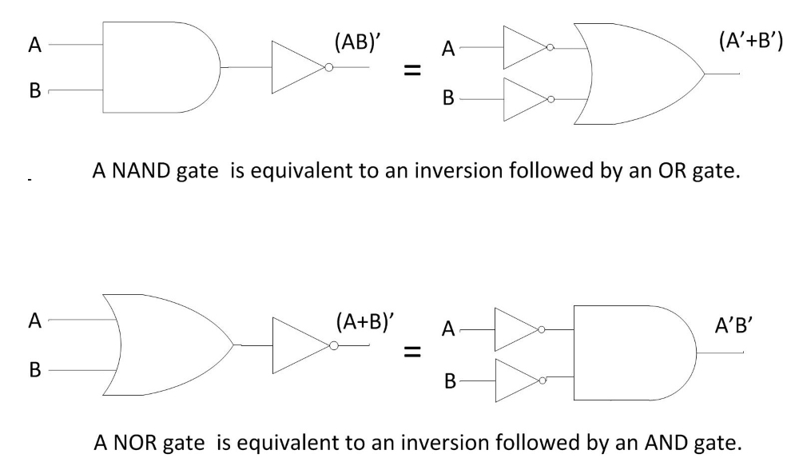  

**Fig. 1 De-Morgan's theorems implemented with basic gates** 

We can show this equivalence using the following truth tables :-

#### **De-Morgan's Theorem 1:**

  

**Truth Table of De-Morgan's Theorem 1**

|A|B|A + B|(A + B)'|A'|B'|A'.B'|
| :--: | :---: | :---: | :---: | :---: | :---: | :----: |
|0|0|0|1|1|1|1|
|0|1|1|0|1|0|0|
|1|0|1|0|0|1|0|
|1|1|1|1|0|0|0|

 

#### **De-Morgan's Theorem 2:**

  

**Truth Table of De-Morgan's Theorem 2**

|A|B|A.B|(A.B)'|A'|B'|A' + B'|
| :--: | :---: | :---: | :---: | :---: | :---: | :----: |
|0|0|0|1|1|1|1|
|0|1|0|1|1|0|1|
|1|0|0|1|0|1|1|
|1|1|1|1|0|0|0|
  

The output values corresponding to each set of input values for both the Boolean expressions in the truth-tables are equal. Therefore, the expressions must be equal.

#### **Mathematical Proof of De-Morgan’s Theorems**

#### **De-Morgan's Theorem 1:**

It states that

**(A + B)' = A'.B'** 

**Proof :-** To prove this theorem, we need to recall complementarity laws, which state that

 

**X + X' = 1 and X.X' = 0** 

i.e. a logical variable/expression when added with its complement produces the output as 1 and when multiplied with its complement, the output as 0.  
Let us assume that

**P = (A + B)** 

where P, A, B are logical variables.  
Then, according to complementation law

**P + P' = 1 and P.P' = 0** 

If P = A + B then P' = (A + B)' and If P' i.e. (A + B)' = A'B' then

a.  (A + B) + (A'.B') must be equal to 1 {as X + X' = 1}  
b.  (A + B).(A'.B') must be equal to 0 {as X.X = 0}

Let us first prove the first part, i.e. (A + B) + (A'.B') = 1. 

**(A + B) + (A'.B') = \[(A + B) + A'\].\[(A + B) + B'\] {as X + Y.Z = (X + Y)(X + Z)}  
\= (A + A' + B).(A + B + B') {as X + Y = Y + X}  
\= (1 + B).(A + 1) {as X + X' = 1}  
\= 1.1 {as 1 + X = 1}  
\= 1 {as X.1 = 1}** 

Thus first part is proved.  
Now let us prove the second part i.e. (A + B).(A'.B') = 0  

**(A + B).(A'.B') = (A'.B').(A + B) {as X.Y = Y.X}  
\= A'.B'.A + A'.B'.B {as X.(Y + Z) = X.Y + X.Z}  
\= A.A'.B' + A'.B.B'  
\= 0.B + A'.0 {as X.X' = 0}  
\= 0** 

Thus, second part is proved. Therefore, De-Morgan’s first theorem is proved.

#### **De-Morgan's Theorem 2:**

It states that

**(A.B)' = A' + B'** 

**Proof :-** This theorem can be proved in the same way by letting P = A.B  
Let us assume that

**P = (A.B) then P' = (A.B)'** 

where P, A, B are logical variables.  
Then, according to complementation law

**P + P' = 1 and P.P' = 0** 

If P = A.B then P' = (A.B)' and If P' i.e. (A.B)' = A' + B' then

1.  (A.B) + (A' + B') must be equal to 1 {as X + X' = 1}
2.  (A.B).(A' + B') must be equal to 0 {as X.X = 0}

Let us first prove the first part, i.e. (A.B) + (A' + B') = 1. 
 

**(A.B) + (A' + B') = (A' + B') + (A.B) {as X + Y = Y + X}  
\= (A + A' + B).(A' + B + B') {as X + Y.Z = (X + Y)(X + Z)}  
\= (1 + B').(A' + 1) {as X + X' = 1}  
\= 1.1 {as 1 + X = 1}  
\= 1 {as X.1 = 1}** 

Thus first part is proved.  
Now let us prove the second part i.e. (A.B).(A' + B') = 0  

**(A.B).(A' + B') = (A.A'.B').(A.B.B') {as X.(Y + Z) = X.Y + X.Z}  
\= A.A'.B' + A'.B.B'  
\= 0.B + A.0 {as X.X' = 0}  
\= 0** 

Thus, second part is proved. Therefore, De-Morgan’s second theorem is proved.  
Although we have used De-Morgan’s theorems with only two input variables A and B, they are equally valid for use with three, four or more input variable expressions.  
For example, For a 3-variable input **(A + B + C)' = A'.B'.C'**  
and also **(A.B.C)' = A' + B'+ C'**

#### **Applications of De-Morgan’s Theorems**

Applications of De Morgan’s theorems are in the fields of

1.  Engineering – Building circuits
2.  Set Theory – Venn diagrams
3.  Computer Programming

#### **Engineering**

De Morgan’s theorems are used to simplify Boolean expressions to build equations using only one sort of gate, generally NAND or NOR gates. This can lead to cheaper hardware. For practical implementations NOR, NAND and NOT gates work best.  
For example, using De Morgan’s law 

 

A long bar extending over the term AB acts as a grouping symbol when stretched over more than one variable. De-Morgan’s theorem may be thought of in terms of breaking a long bar symbol. When a long bar is broken, the operation directly underneath the break changes from addition to multiplication or vice versa and the broken bar pieces remain over the individual variables.  

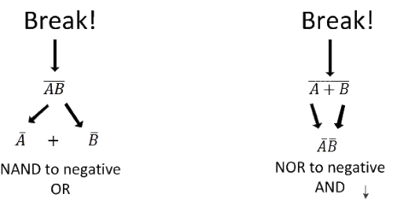   

When multiple “layers” of bars exist in an expression, one may only break one bar at a time, and it is generally easier to begin simplification by breaking the longest (uppermost) bar first.  
Let’s apply the principles of De-Morgan’s theorems to the simplification of a gate circuit shown in Fig. 2(a).  

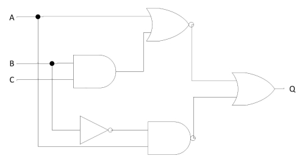 

**Fig. 2(a) A circuit to be simplified using De-Morgan’s theorems** 
 

As always, our first step in simplifying this circuit must be to generate an equivalent Boolean expression. We can do this by placing a sub-expression label at the output of each gate (Fig. 2b), as the inputs become known. Here’s the first step in this process(Fig.2(b)-(d) Steps leading to generation of Boolean expression corresponding to circuit) :-

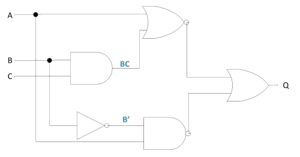  

**Fig.2(b)** 

We can label the outputs of the first NOR gate and the NAND gate. When dealing with inverted-output gates,it is easier to write an expression for the gate’s output without the final inversion, with an arrow pointing to just before the inversion bubble. Then, at the wire leading out of the gate (after the bubble), the full, complemented expression is written as shown in Fig. 2(c). This helps ensure a complementing bar in the sub-expression.  

 

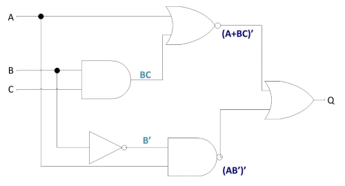  

**Fig.2(c)**  

Finally, we write an expression (or pair of expressions) for the last NOR gateas shown in Fig. 2(d).  

 

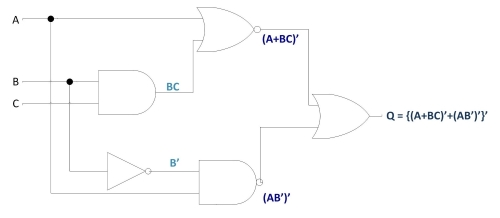

**Fig.2(d)** 
 

Now, we reduce this expression using the identities, properties, rules, and theorems (De-Morgan’s) of Boolean algebra.  

 

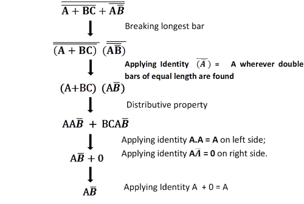  
 
  

Fig. 3 shows the equivalent gate circuit for this much-simplified expression as follows :-

 
  
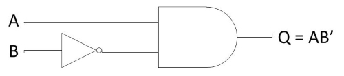    

**Fig. 3 Equivalent Gate circuit for the expression simplified using De Morgan’s theorems** 
 

#### **Set Theory**

De-Morgan's Laws describe how mathematical statements and concepts are related through their opposites. In set theory, De-Morgan's Laws relate the intersection and union of sets through complements. In propositional logic, De-Morgan's Laws relate conjunctions and disjunctions of propositions through negation. De-Morgan's Laws are also applicable in computer engineering for developing logic gates.  
Interestingly, regardless of whether De-Morgan's Laws apply to sets, propositions, or logic gates, the structure is always the same.

#### **De-Morgan's Laws**

_Not_ (**A** _and_ **B**) is the same as _Not_ **A** _or Not_ **B**.  
_Not_ (**A** _or_ **B**) is the same as _NOT_ **A** _and Not_ **B**.  
This same structure can be used to make observations in cardinality of sets, to calculate certain probabilities and to write equivalent propositions.

#### **De-Morgan's Laws for Sets**

For sets, De-Morgan's Laws are simply observations about the relation between sets and their complements. An easy way to visualize these rules is through Venn Diagrams.  
Let us observe the union of the complements of two sets. On a Venn diagram, this union covers all space in the Venn diagram except for the intersection of the two sets. Hence, De-Morgan's Law for the complement of an intersection of two sets.

#### **Complement of an Intersection of Two Sets**

The complement of the intersection of sets A and B is equal to the union of Ac and Bc as shown in Fig. 4.  

 

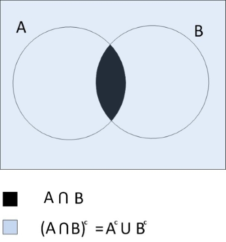  

**Fig. 4 Complement of an intersection of sets A and B** 
 

Let us observe the intersection of the complements of two sets. On a Venn Diagram, this intersection covers all space in the Venn Diagram except for the union of the two sets. Hence, De-Morgan's Law for the complement of a union of two sets.  

#### **Complement of a Union of Two Sets**

The complement of the union of sets and is equal to the intersection of Ac and Bc as shown in Fig. 5.  

    

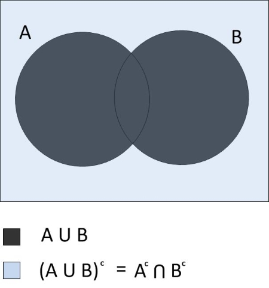  

**Fig. 5 Complement of a union of sets A and B** 
 

De-Morgan's Laws can be generalized to any number of sets.  
**Generalization of the Complement of Intersection of Sets :-**  
Let {A1, A2,……, An-1, An} be a set of sets. The complement of the intersection of these sets is  
 
  

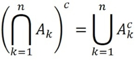  
 

The **∩** and **U** symbols above are used to represent an intersection or union of many sets. For example, suppose there are four sets B1, B2, B3 and B4. The union of these sets could be represented by (B1 ∪ B2 ∪ B3 ∪ B4). However, it could be represented more concisely with  

 

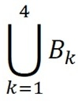  
 
**Generalization of the Complement of a Union of Sets**  
Let {A1, A2,.…., An-1, An} be a set of sets. The complement of the union of these sets is  

   

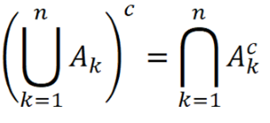 
 

Because these generalizations require finding the unions and intersections of many sets, it is important to consider the principle of inclusion and exclusion when calculating the cardinality of sets with De-Morgan's Laws.

#### **Computer Programming**

De-Morgan’s law is something that any student of programming eventually needs to deal with. Understanding De-Morgan’s law in programming, is critical if we want to know how to write code that negates two Boolean conditions.  
De-Morgan’s laws state that specific Boolean statements can be written in different ways to the same effect. The precise definition can be seen here.  

1.  A group of negated _And's_ is the same as negated group of _Or's_ i.e **(!a&& !b && !c) === !(a || b || c)**
2.  A group of negated _Or's_ is the same as a negated group of _And's_ i.e **(!a || !b || !c) === !(a && b && c)**

This is cool, but how can this be used in software?  
**Checking for Missing a Minimum Requirement**  
The first rule expresses that a group of negated _And's_ is the same as a group of negated _Or's_. This can be used any time we want to take action when at least one condition must be met. In the below example, we will check that at least a user name, user id or user e-mail is provided. If not, we will throw an error.  
Here we express it as **(!a&& !b && !c)** :-  
constuserName = null;  
constuserId = null;  
constuserEmail = null;  
if(!userName&& !userId&& !userEmail)) {  
throw new Error('At least one user identifier must be passed');  
}  
Here we express it as **!(a || b || c)** :- constuserName = null;  
constuserId = null;  
constuserAlias = null;  
if(!(userName || userId || userAlias)) {  
throw new Error('At least one user identifier must be passed');  
}  
By using the first method, we can simply read this as 'At least one of these is required'.  
**Checking for Requirements**  
The second rule expresses that a group of negated _Or's_ is the same as a negated group of _And's_. This can be used any time you want to take action when there are a series of conditions that must be met. In the example below, we will check that a sequence of requirements is provided. If not, we will throw an error.  
Here we express it as **(!a || !b || !c)** :- constrequirementA = true;  
constrequirementB = false;  
constrequirementC = true;  
if(!requirementA || !requirementB || !requirementC) {  
throw new Error('All of the requirements must be met');  
}  
Here we express it as **!(a && b && c)** :- constrequirementA = true;  
constrequirementB = false;  
constrequirementC = true;  
if(!(requirementA&&requirementB&&requirementC)) {  
throw new Error('All of the requirements must be met');  
}  
By using the second method, we can simply read this as 'All these are required'.  

Thus, De-Morgan’s laws can help simplify the code to make it more readable. We can change a sequence of negated _And's_ to something that reads as 'At least one of these is required' and a sequence of negated _Or's_ to something that reads as 'All of these are required'.

